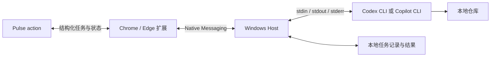

# Pulse Extension: current requirements and historical scope

Updated: 2026-09-23. Project: `MuyuanMS/powertoys-pulse-actions/pulse-extension`, imported from `moooyo/Pulse-Extension`.

## Current requirements — supersedes the historical design below

The current requirements are the [approved PR/Issue workflows](pr-issue-workflow-proposal.md), [v3 result contract](workflow-v3-wire.md), and the summary below. The original numbered design and unchecked checklist later in this file are historical requirements, not a current implementation backlog or new permission to execute work.

- Local tasks target `microsoft/PowerToys`. Use the English extension interface and retain quoted source and raw CLI output in their original language. Agent-generated summaries and result prose follow the Host's English output instruction.
- **Tasks** is the single workspace entry. Its Target filter selects all targets, PRs, or Issues, and View selects active work with five recent outcomes or all finished runs, including failed, cancelled and interrupted attempts. User deletion preserves repository changes and task worktrees.
- **PR Review** has immutable `static`, `build-tests` and `ui-e2e` scopes, initially `build-tests` in the website. Every scope uses a complete internal Loop: cover the relevant change, recheck every candidate, remove false positives and duplicates, check omissions and deliver all confirmed P0–P3 findings once. Unfinished coverage is explicitly incomplete. Review does not apply production fixes automatically.
- PR E2E necessity is a separate `not_needed`, `recommended` or `required` assessment with reasons, scenarios, expected observations and prerequisites. Unselected E2E does not fail a completed static review. Linked verification adds matching-source evidence without repeating the whole review or rewriting the original assessment.
- **Issue Research** distinguishes integrated Feature Research from Bug Investigation. Feature research includes technical feasibility in one final conclusion. Bug investigation uses a complete Loop and separates confirmed defects, actual reproduction, information gaps and specific remaining experiments. Saved plans support explicit implementation, fix, reproduction and verification tasks.
- V3 final results retain the complete finding set, evidence, diagnostics and typed next steps. Large reports are paged without silent truncation. Raw stdout/stderr limits are 64 MiB per stream for v3 and 8 MiB for legacy tasks; output loss remains explicit. Actual CLI process failure cannot become model-reported success.
- Manual GitHub operations are separate from advice and task completion. Only confirmed unresolved P0 on the current original PR adds an Approve business restriction; actual account, target, state and SHA checks still apply. Selected feedback, editable code suggestions, ordinary comments and Request changes are distinct. Duplicate Issue closure names a verified canonical Issue and can be replaced by a linking comment. Reading, completing or reconnecting a task never submits a GitHub write.
- Settings list detected Codex/Copilot executables and optional version/source metadata without compatibility gates or automatic selection. The user chooses an installation. Optional connectivity tests do not gate saving. Configure per-CLI model/effort defaults and override agent/model/effort for one task; actual runtime metadata is displayed only when observed from the selected CLI.
- Default local permissions are `yolo`, with `read-only` and `workspace-write` available. Accepted work keeps its saved permissions, source and execution choices. Tasks have no execution deadline and support explicit cancellation.
- Require a PowerToys main checkout and an external worktree root. Ordinary tasks capture the main HEAD; PR tasks verify and fetch their expected SHA. Each task gets `pulse-<runId>` and `codex/pulse-<runId>`. Saved-plan tasks retain parent/source identity; local-candidate verification restores an immutable snapshot. Preserve unrelated existing work.
- Maintain eight business prompts and a shared verification fragment in this repository and embed them in the Host. New tasks load offline without remote prompt synchronization, an external skill, another vendor or Copilot cloud review. The Host injects only the applicable task/scope rules; static PR review omits runtime guidance. Freeze rendered content, hashes, schema version and bundle revision at acceptance; preserve old task snapshots and sync caches as history.
- The website hands tasks and typed GitHub drafts to the extension. A confirmed new-task receipt closes the website dialog and leaves a task notice; the extension tracks execution. Installation, Host/configuration errors and uncertain request recovery have distinct handling. Request recovery does not silently resubmit work.
- Extension GitHub operations use the selected local `gh` account per command without switching the global account or storing credentials. The narrow supported fork-Issue comment target is documented in [Actions integration](actions-integration.md); it does not widen the PowerToys-only local-task boundary.
- Preserve production browser-detachment guards and maintenance exclusion. Local fixtures and supervised worker tests do not prove the complete installed-browser lifecycle.

## Delivery and acceptance status

The plugin/Host implementation and prompt maintenance were merged and pushed to plugin `main` as `b33319c`. The local Windows package and installed Host were verified; [v3 validation](workflow-v3-validation.md) and [prompt maintenance](prompt-optimization-gpt6.md) record the exact evidence and package revision. Website integration remains in its task worktree, unmerged and undeployed by user choice. The separate PowerToys verification skill is also unmerged and is not bundled in the Host.

CI is deferred by the user. Complete real Chrome/Edge × Codex/Copilot lifecycle testing, new GPT-6 workflow quality, and real GitHub-write acceptance are reserved for the user's later testing. These checks remain unverified; they are not claimed by local automated tests or preview samples. This documentation update does not build, deploy the website, add CI or execute those tests.

## 历史 Scope 原文

实现说明：本文件保留原范围评审时的措辞（包括“本轮只交付文档”）。后续实现已在本仓库开展；当前交付、具体协议与验证证据以 [README](../README.md)、[协议](protocol.md) 和 [验收记录](acceptance.md) 为准。未完成的真实环境验收不会视为已通过。

本文定义扩展与本地 Host 的首期交付范围。本次只交付 scope 文档，不实现、安装或发布软件。下文区分用户已确认的要求、建议采用的首期默认值，以及仍需原型验证的技术细节。

## 1. 目标与已确认要求

用户在扩展中预先配置 Codex CLI 或 GitHub Copilot CLI，以及自己的 repo folder。之后在 PowerToys Pulse 中点击 action 即开始执行，不再选择 agent 或目录。扩展负责观察各个 action 的执行情况、找回历史记录，并在 CLI 结束后提示用户下一步做什么。

已确认的要求：

- 浏览器同时支持 Google Chrome 和 Microsoft Edge。
- agent 同时支持 Codex CLI 和 GitHub Copilot CLI。
- 使用哪个 agent，以及各仓库对应的 repo folder，都在扩展设置中配置；点击 action 不再询问选择。
- 扩展可以独立查看各个 action 的执行进度和结果，并区分同一 action 的多次执行。
- 点击 Chrome/Edge 工具栏中的扩展图标，直接打开任务面板，查看正在执行的任务、状态以及已完成任务。
- 浏览器关闭后重新打开，仍能找回任务记录、实际状态、已有结果和待处理的下一步。
- 关闭浏览器不停止已接受的 CLI 任务；任务在本机继续执行，重开后找回同一次执行，不能以重新启动 CLI 代替恢复。
- 任务信息、执行状态、日志和结果保存在本地任务目录的文件中，首期不引入数据库。
- CLI 执行结束后，扩展明确提示下一步操作，不只显示“完成”或原始日志。
- 用户可根据结果选择并实际执行后续操作，包括 Approve PR、发送 suggested changes、Request changes、关闭对应 issue/PR。CLI 完成本身不触发这些写操作。
- 接受在本机安装 Native Messaging Host。
- Host 安装注册完成后，由浏览器按需启动，不要求用户手动运行，也不要求预先打开终端或启动常驻服务。
- 扩展与 Host 在本仓库开发；当前先完成 scope。

“本地执行”指 CLI 在用户机器上操作仓库、执行工具；模型请求使用 CLI 自身配置的服务，不承诺离线推理。

## 2. 建议采用的首期边界

以下是为控制首期工作量提出的默认值，不视为用户已经逐项确认：

| 项目 | 首期建议 |
| --- | --- |
| 操作系统 | Windows 11 x64；其他系统和架构后续增加 |
| 浏览器 | Chrome、Edge 当前稳定版，验收时记录准确版本 |
| CLI 版本 | 分别锁定通过验证的版本；不承诺任意历史版本均可用 |
| 会话方式 | 以非交互 CLI 创建新任务 |
| 执行并发 | 同一 Git 仓库一次只执行一个任务，两个浏览器的 Host 共同遵守执行锁和去重记录 |
| 浏览器关闭行为 | 已确认：CLI 任务继续执行；重开后恢复同一次执行的状态、结果和下一步 |
| 配置范围 | 扩展提供设置入口；同一 Windows 用户的两个浏览器共享本地 agent 设置、仓库目录映射与任务记录 |
| 任务历史 | 每次执行一个目录，用文件保存任务、状态、日志和结果；页面刷新、浏览器重开均可恢复 |
| 初期分发 | 内部试用：扩展包与 Host 按用户安装包；商店上架另行安排 |

用户已明确要求浏览器关闭期间继续执行，以及重开后恢复同一次任务。Host 需要同时保证任务独立执行和持续记录输出，不能只保存关闭前的快照。执行过程中遇到 CLI 自身错误、用户取消、超时或系统关机，仍按实际情况记录终态。

产品组件统一为扩展和 Host。Host 负责浏览器通信、CLI 执行和数据持久化，不再拆出独立的用户可见组件。Host 内部可按需采用不同执行模式或进程，以保证浏览器连接消失后 CLI、日志和结束状态仍受管理；这属于同一安装组件的实现细节。首期不依赖用户手动启动本地程序，不安装 Windows 服务，也不监听 localhost HTTP / WebSocket 端口。

## 3. 交付内容与仓库边界

| 交付项 | 包含内容 |
| --- | --- |
| 浏览器扩展 | Manifest V3 共用代码；agent 与 repo folder 配置页；工具栏图标任务面板；Pulse 消息入口；任务详情与恢复；取消；结果与后续 GitHub 操作 |
| Windows Host | 浏览器通信、配置、CLI 适配与后台执行、任务文件与结果恢复；固定 GitHub 操作适配及提交记录 |
| 安装与卸载 | 用户级安装；Chrome/Edge 分别注册；扩展 ID 配置；安装检测；重装修复；卸载清理 |
| 配套资料 | 安装、登录前置条件、故障诊断、协议说明和四种组合的验收记录 |
| 集成示例 | 最小开发测试页，验证网页到扩展再到 CLI 的完整链路 |

PowerToys Pulse 主站的前端改造属于配套集成工作，代码位于 `powertoys-pulse` 仓库，不混入本仓库。实现阶段需要在该仓库单独完成接入，才能验收真实 Pulse action。本轮不修改 Pulse。

建议代码布局如下，仅用于说明职责，本轮不创建实现目录：

```text
extension/       浏览器扩展
host/            Native Messaging Host、任务记录与两个 CLI 适配器
installer/       安装、注册、卸载工具
examples/        最小网页集成示例
docs/            scope、协议、安装与验收说明
```

技术栈建议为 TypeScript + Manifest V3，以及 C#/.NET 自包含 Windows Host，以减少使用者额外安装运行时的步骤。具体框架版本和打包方式在原型阶段确定，本文不锁定。

## 4. 用户流程

### 4.1 首次配置

1. 用户安装扩展和 Host；Host 自动启动，无需手动运行。
2. 安装程序注册当前浏览器的 Host 配置；同时使用 Chrome 和 Edge 时分别完成注册。
3. 用户自行安装并登录需要使用的 CLI。仅安装其中一种时，可以先使用该 agent；另一种显示未安装。
4. 在扩展设置中选择使用的 agent（Codex CLI 或 Copilot CLI），确认检测出的 CLI 路径，并填写/选择 repo folder。首期以一个选定 agent 和仓库标识到目录的映射为主，不引入复杂配置档案。
5. 本地组件检查目录存在、可访问且为预期 Git 仓库，再保存配置；扩展显示实际选定的 agent、目录和可用状态。能力检测不应主动提交模型任务。

需要提交 review/comment 或关闭 issue/PR 时，设置页显示用于 GitHub 操作的本地账号和可用性。该身份独立于选择哪一种 agent；优先复用本地 GitHub CLI 的已有认证，不把 Copilot 登录等同于所有 GitHub 写权限。GitHub 认证不可用时仍可执行本地分析任务，提交操作提供登录/权限指引。

仓库目录、可执行文件路径和权限策略属于本地设置，仅可通过受信任的扩展设置流程修改；Pulse 网页不能直接修改。

同一 Windows 用户在 Chrome/Edge 中看到同一份本地配置；设置页保存变更后，另一浏览器读取时刷新。任务被接受时保存 agent、CLI 路径、repo folder 与权限策略的配置快照；运行中修改设置只影响之后的新任务。

### 4.2 日常执行

1. 用户在 Pulse action 上点击 `Run locally`，不弹出 agent 或目录选择。
2. Pulse 发送业务任务，扩展检查来源并连接 Host；agent 和目录从已保存的本地配置解析。
3. 浏览器自动启动 Host。Host 检查消息、CLI 版本、仓库配置和执行锁，持久保存本次任务与配置快照后确认接收。
4. Host 启动选定 CLI，传入 prompt，持续记录结构化事件并转发扩展。
5. 扩展任务列表和 Pulse 显示执行进度；用户可在扩展查看详情或取消任务。
6. CLI 结束后，Host 保存结果并标记未读；扩展连接时立即提示下一步，未展示的结果在下次连接补充提示。Pulse 打开时同步显示结果。
7. 用户从扩展任务面板打开结果，查看或编辑待提交内容，选择相应后续操作；Host 执行后返回 GitHub 结果链接并保存提交记录。

无需用户复制 prompt、手动打开终端或先启动 Host。未安装扩展/Host 或 CLI 不可用时，Pulse 应提供对应的配置指引，并保留现有复制 prompt 入口。

尚未配置 agent 或 repo folder 时，action 提示“先配置扩展”并打开设置入口，不在点击流程中临时选择或静默切换另一种 agent。

### 4.3 扩展任务列表与重开恢复

- 点击工具栏扩展图标直接打开任务面板，不要求用户先进入 Pulse 网站。首期包含“运行中”“待处理”“历史”视图，默认优先显示运行任务与待处理结果。
- 面板展示任务数量、当前状态和最近进度；点击任务进入详情。较长日志或 review 编辑可展开到扩展独立页面，入口仍从扩展图标进入。
- 无需保持 Pulse 标签页打开，扩展自己的任务页面即可查看所有已记录的 action。
- 列表按 action 关联各次执行，展示 issue/PR、action 类型、实际 agent、repo folder、状态、最近更新时间和结果摘要；详情提供执行日志、产物与下一步。
- 区分“任务状态”和“连接状态”。失联时显示最后已知状态与时间，不直接把 `running` 改成成功、失败或中断。
- 重开浏览器后，扩展自动连接本地组件，查询任务快照，再从事件游标补齐更新；恢复查询不重新提交 prompt。
- 尚在执行的任务恢复实时观察；已在浏览器关闭期间完成的任务直接显示最终结果和下一步，无需重新启动 CLI。
- 扩展显示运行任务数和未读结果入口。浏览器关闭期间产生的终态和未读结果，在下次连接后补充提醒。
- “待处理”表示任务已有结果，尚需用户选择下一步或明确标记已处理；“已读”与“已处理”分开，打开结果不等于已经提交 review 或完成处置。

### 4.4 根据执行结果选择下一步

扩展任务详情必须同时回答：做了什么、产出了什么、哪些验证已完成/未完成、用户接下来做什么。首期示例：

| 执行结果 | 提供的下一步 |
| --- | --- |
| 修复产生本地改动 | 查看改动和已执行的验证，再按剩余验证清单处理 |
| Review 或 E2E 生成报告 | 查看报告和建议，选择 Approve、提交修改建议、Request changes、普通评论或关闭目标 |
| 缺少登录、目录配置或权限 | 显示具体原因及配置指引；修正后可主动重新运行 |
| 任务失败、取消或中断 | 查看错误与已有产物，说明是否存在未完成改动，再决定如何处理 |
| 没有后续动作 | 明确显示“无需后续操作”，仍可查看结果 |

首期支持以下实际操作，按任务目标、结果中可用的证据和用户权限展示：

| 操作 | 对象及效果 | 提交前展示内容 |
| --- | --- | --- |
| Approve PR | 向对应 PR 提交 `APPROVE` review，不执行 merge | PR、所评审的 SHA、账号及可选 review 正文 |
| 发送 suggested changes | 向 PR diff 提交包含 GitHub suggestion 的行级评审内容；不自动应用或推送代码 | 文件、有效行范围、原代码与建议替换、可编辑说明 |
| Request changes | 提交 `REQUEST_CHANGES` review，可包含用户选定的行级建议 | PR、评审 SHA、需要修改的问题和 review 正文 |
| 发送普通评论/review | 提交用户选定内容，用于无需行级建议或不作批准判断的反馈 | 评论类型、目标及完整正文 |
| Close issue / Close PR | 关闭当前任务关联的 issue 或 PR，不是结束本地任务，也不是 merge | 明确标注目标类型、编号和当前状态 |

CLI 根据结果提供建议和草稿，用户可选择其他适用方案、编辑正文、选取部分建议，或暂不处理。界面先展示实际目标与待提交内容，再由用户点击具体操作完成提交，不重复叠加通用确认弹窗。CLI 完成、浏览器重连和查看结果均不能自动发出 GitHub 写请求。

继续提供“查看结果/产物”“打开原 issue/PR”“打开扩展设置”“重新运行”“标记已处理”等本地操作。重新运行产生新的任务记录；标记已处理不调用 GitHub，也不改变 CLI 原始执行结果。

## 5. 调用链路与浏览器支持



- Pulse 使用 `externally_connectable` 对应的消息通道连接扩展。优先显式调用接口，不依赖 DOM 抓取或模拟点击。
- 发布配置只允许明确列出的 Pulse origin。当前站点为 `https://cautious-memory-r38ze9j.pages.github.io`；localhost 测试 origin 仅在开发配置启用。
- 扩展 service worker 使用 `chrome.runtime.connectNative()` 建立持续连接，接收进度与结果。
- Host 统一负责执行与记录。Chrome/Edge 可以分别启动 Host 进程，多个实例必须协调仓库锁、去重记录和配置，不能重复执行同一请求。
- 这里的 Host 是一个安装组件，不强制内部始终只有一个进程。后台执行、日志收集和结束记录由同一 Host 软件内部承担；不增加用户可见组件或手动启动步骤。
- Windows 父进程退出不会自动终止其子进程。已检查的当前 Chromium 清理路径会终止 Native Messaging Host 的进程句柄，没有在该路径中终止整棵子进程树；不能据此断言 CLI 会因浏览器关闭而退出。
- Native Messaging 连接进程仍受浏览器生命周期约束。必须将 CLI 的 stdin/stdout/stderr、输出收集和结束记录与该连接解开；不能只把输出通过连接 Host 的内存或管道转发浏览器。实际 CLI 版本及目标环境中的进程、管道和 Windows Job 行为仍需验证。
- 两种浏览器共用业务代码；按实际安装来源配置扩展 ID，不假定 Chrome 与 Edge 商店 ID 相同。
- Host 的 `allowed_origins` 使用明确的 `chrome-extension://<extension-id>/` 列表，不使用通配符。
- Chrome、Edge 都有独立的用户级 Host 注册项。即使 Edge 支持查找 Chrome 注册项，安装程序也应显式注册两者，不依赖回退行为。

建议 Host 名称为 `com.powertoys.pulse`，需在实现前最终固定。相应注册位置为：

```text
HKCU\Software\Google\Chrome\NativeMessagingHosts\com.powertoys.pulse
HKCU\Software\Microsoft\Edge\NativeMessagingHosts\com.powertoys.pulse
```

默认值指向 Host manifest 的绝对路径，manifest 指定本地程序位置和允许的扩展 ID。两种浏览器可以使用同一个 Host 二进制文件。

Host 是单独安装的本地组件，安装扩展本身不能静默安装它。普通用户级安装以不需要管理员权限为目标；受管浏览器的扩展和 Native Messaging 策略需在试用环境验证。

## 6. CLI 接入范围

| 能力 | Codex CLI | Copilot CLI |
| --- | --- | --- |
| 创建任务 | `codex exec` | 程序化执行模式 |
| prompt 输入 | `codex exec --json -`，完整 prompt 写入 stdin | prompt 写入 stdin 时不加 `-p`；也支持 `-p <prompt>` |
| 结构化输出 | `--json` 输出 JSONL | `--output-format=json --stream=on` 输出 JSONL |
| 工作目录 | Host 设置进程工作目录，必要时使用 CLI 对应参数 | 同左 |
| 登录 | 使用本地 CLI 已保存的认证与配置 | 同左 |
| 取消 | Host 管理 CLI 及其子进程 | 同左 |

表中命令展示输入输出接口，不是完整生产启动参数。权限、网络和非交互行为必须分别适配，并通过原型验证。

首期本地 CLI 适配层应：

- 解析实际可执行文件路径，以参数数组直接创建进程；不拼接包含网页输入的 shell 命令。
- 使用 stdin 传递完整 prompt，避免长命令行和转义问题。
- 分开处理 CLI 的 stdout JSONL、stderr 诊断和退出码；stdout 按完整行解析，兼容数据分片。
- 无论浏览器是否打开，都要将 CLI 输出持续写入本次任务的文件。Host 的 CLI 启动封装负责记录开始、结束和退出码，并更新状态与结果；不能假定 Codex/Copilot 原生会自动维护我们定义的状态文件，也不能只保存 PID 或最后一条日志。
- 将两种 CLI 的事件转换为统一的任务状态、文本进度、结果和错误；不假定它们的 JSON 字段相同。
- 请求 CLI 返回适合展示的完成摘要、产物、验证情况和建议下一步，并由本地适配器校验后存储。两种 CLI 的结果协议需要分别适配，不假定原生 JSONL 已包含相同的“下一步”字段。
- 使用本地已配置的权限，保留 CLI 自身的项目指令加载。不得默认添加跳过所有审批、沙箱或项目规则的参数。
- 对无法在当前非交互模式完成的授权或提问给出明确错误；超时后可停止任务。首期不承诺把任意终端审批搬到网页中处理。

前期只读调研观察到本机 Codex CLI `0.145.0`、Copilot CLI `1.0.79` 的帮助中存在上述核心接口。这不是最低兼容版本声明，也不是端到端运行通过记录。

Copilot `1.0.79` 的帮助对非交互模式的全量工具授权描述，与官方文档的精细授权示例存在差异。实现前必须验证该版本如何处理 stdin、精细权限、拒绝和退出；不能通过默认开启全量权限绕过验证。

## 7. 任务协议和生命周期

### 7.1 协议范围

本仓库定义版本化消息协议。下列字段和名称是建议结构，详细 schema 在实现阶段补齐：

- 网页任务请求：`protocolVersion`、`requestId`、`actionId`、`actionKind`、`repository`、issue/PR 标识、`expectedHeadSha`、上下文和 `prompt`。不接受网页覆盖 agent、CLI 路径或 repo folder。其中 `expectedHeadSha` 对绑定 PR 版本的 review/E2E 任务必填，其他任务可省略。
- 控制请求：能力检测、分页列举/查询任务、按游标订阅事件、取消任务、标记结果已读/已处理；设置修改使用独立的扩展设置通道。
- 后续操作请求：来自扩展结果面板，包含 `operationId`、来源 `runId`、操作类型、固定目标、评审依据 SHA 及用户最终选定内容；不允许网页或 CLI 输出直接触发提交。
- 任务响应：`runId`、关联的 `requestId/actionId`、实际配置快照、任务状态、事件序号、时间戳，以及完成结果或错误。
- 本地配置：选定的 agent、CLI 路径、仓库到 repo folder 的映射、运行权限与超时上限；不接收网页传来的等价覆盖字段。

完整配置快照和跨 action 的任务列表供扩展内部查看；转发给 Pulse 时，只提供关联 action 的状态、结果和必要展示字段，不附带全部本地设置或无关任务记录。

`actionId` 关联同一业务 action，`runId` 标识一次执行，`requestId` 用于重传去重。用户主动重新运行时产生新的请求和执行记录；不能因为 action 相同就覆盖历史结果。

Native Messaging 使用长度前缀 JSON，CLI 使用 JSONL，不能直接把 CLI 注册为 Host。Host 内的 CLI 适配器解析 JSONL，产生统一事件并转换为 Native Messaging 帧。Host 的 stdout 仅写协议帧，程序日志走 stderr 或本地日志。

实现需定义并校验输入大小、单条事件大小、队列和日志上限；长日志分片传输，不能把无限输出积压在扩展内存中。

### 7.2 首期任务状态

```text
accepted → running → succeeded / failed / cancelled / interrupted
```

`accepted` 表示 Host 已持久接收任务，不能在仅显示 UI 提示时标记成功。CLI 退出码、CLI 明确报告的失败事件以及观察连接失联需分别处理；收到自然语言结果不等于执行成功。未启动的非法或忙碌请求直接返回错误。

观察连接另有 `connected / reconnecting / disconnected` 状态，不代替任务状态。连接中断只表明当前观察不到进度；必须查询本地执行记录并核对进程后，才能更新任务终态。终态另附结果已读状态，不因用户读过结果而改变执行状态。

CLI 状态与后续操作状态分开。每次用户提交有独立 `operationId`，建议状态为 `prepared / submitting / succeeded / failed / unknown`。`unknown` 表示网络中断等原因导致远端结果尚待核实；提交失败不能把已完成的 CLI 任务改成失败，CLI 成功也不等于 review 已提交。

### 7.3 连接、取消与并发

- 每次 Native Messaging 连接可能启动独立 Host；实例间必须共同遵守本地执行锁和持久记录，不因重新连接而重建任务。
- 关闭 Pulse 页面、扩展弹窗、浏览器，或重启 service worker，只改变观察连接，不能隐式停止已接受的任务。浏览器断开期间 CLI 继续执行，输出和结束信息持续保存。
- 浏览器重新打开时自动启动连接 Host，读取本地记录并核对原任务身份。运行中的任务重新订阅进度，已结束的任务读取退出信息和结果，不重新启动 CLI。
- Host 运行期间管理 CLI 和其子进程。显式取消或超时时先尝试正常停止，再按受控超时终止进程树，最后确认并记录终态；不能放任 CLI 成为无人管理的孤儿进程。
- Native Messaging 连接进程退出或被浏览器清理，不应停止后台执行或中断输出落盘。Host 内部真正负责执行/记录的部分若异常退出，则需核实任务进程与文件记录，明确报告错误或中断，不能把“连接 Host 退出”和“执行部分故障”混为一谈。
- 取消只停止后续执行，保留已经发生的文件修改；不执行自动回滚。扩展需如实说明可能已有修改或其他已完成操作。连接丢失、设置修改和“标记已读”不等于用户发出了取消指令。
- 同一 Git 仓库的互斥锁需跨 Chrome、Edge 和多个 Host 连接生效，并考虑同仓库不同 worktree 的识别。冲突请求返回“仓库正在执行任务”，首期不实现排队。
- `requestId` 用于避免重复点击和消息重发导致重复执行。同一已接受请求再次到达时返回原执行记录；查询恢复不能改变该执行的 agent、目录或 prompt。
- 执行部分异常或系统重启后，核对遗留 `accepted/running` 记录的进程身份、持久终态和锁；进程已结束且结果完整时读取原终态，确认未完成就消失的任务才标记 `interrupted`。身份无法确认时保留待核实状态，不按旧 PID 盲目终止进程，也不自动重跑。
- 任务接收、进程启动与记录落盘之间的竞争，以及进程被突然终止时的记录完整性，需纳入验证；不能只在 Host 正常退出时才保存数据。
- 首期不承诺机器重启后的自动续跑、进程崩溃后的断点续跑或任意已有 CLI 会话接管。

### 7.4 任务文件与恢复

首期采用普通文件保存任务，一次执行对应一个 `runId` 目录。建议默认目录为 `%LOCALAPPDATA%\PulseExtension\runs\<runId>\`，与用户配置的源码 repo folder 分开。

```text
runs/
  <runId>/
    task.json      action、prompt、仓库标识及本次配置快照
    status.json    执行状态、进程身份、起止时间、退出码和原因
    events.jsonl   持续追加的 CLI stdout 事件
    stderr.log     CLI 诊断输出
    result.json    最终摘要、产物、验证情况和下一步
    view.json      结果已读/已处理等扩展展示信息
    operations/
      <operationId>.json  用户选择的后续操作、提交状态及 GitHub 结果
```

`task.json` 在接收任务时固定；执行状态与已读状态分开，避免扩展标记已读时覆盖执行进度。`result.json` 在有结果时生成，失败或没有结构化结果时保存明确的降级信息。上述文件名在协议设计中固定，不再增加数据库。

后续操作记录包含来源任务、目标、提交账号、操作类型、用户最终内容/所选建议、评审 SHA、提交时间、结果状态及远端 ID/URL。提交前先保存记录；`operations/` 中的数据同样支持重开恢复，不把 GitHub 提交状态混入 CLI 的 `status.json`。

- Host 写入和读取这些文件，扩展通过 Host 查询列表、状态和结果，不需要浏览器直接取得整个本地目录的访问权限。文件是恢复依据，扩展缓存可随时重建。
- 记录不写入产品源码仓库，也不使用浏览器同步存储上传 prompt、路径或日志。Host 退出后，文件仍保留，下次启动即可读取；用户主动重新运行创建新目录，不覆盖上次执行。
- 任务列表可先扫描目录读取任务和状态文件；如需要索引，仅作为可从这些文件重建的缓存，不作为唯一记录来源。
- 在确认 `accepted` 前写入任务与去重记录。持久字段至少包括 action/请求/执行标识、仓库与 issue/PR、关联 SHA、配置快照、创建/开始/结束时间、任务状态、进程关联信息、事件序号、结果、下一步和已读状态。
- 进程关联不能只有 PID；还需可校验的进程启动身份，以及可用时的 CLI session/thread ID。任务结束时持久写入退出码、终态和结果引用，使 CLI 进程已退出后仍能准确恢复；不能依赖重开浏览器时进程仍存在。
- `status.json`、`result.json` 等快照文件先写入同目录临时文件，写完整后原子替换；Host 各实例共享执行锁并协调写入。追加日志按完整行读取，尚未写完的末行留待下次读取，不能误判为整个文件损坏。
- 结束时先保存结果，再提交包含退出码、结束时间和结果引用的终态。浏览器关闭期间也必须完成这些写入；异常断电或执行封装被终止时，重新读取并核实进程，不能只凭文件中旧的 `running` 就判断仍在执行。
- 浏览器重开、service worker 重启或另一浏览器连接时，先读取快照、再补齐事件。事件去重按执行 ID 和序号处理；详细日志被截断时明确提示，仍保留结果摘要和下一步。
- Chrome 与 Edge 在同一 Windows 用户下可查询同一份任务记录；首期不提供跨设备或跨 Windows 用户同步。
- 活动任务和未读结果不能因普通重启丢失。记录保留与手动清理规则需在设置中说明；日志大小上限与任务摘要保留分开处理，清理记录不删除任务产物或仓库改动。

### 7.5 完成结果与提醒

统一结果建议包含 `summary`、`artifacts`、`validation`、`blockers`、`nextSteps`，并与退出码、终态及错误分开存储。`nextSteps` 包含推荐操作、理由和可编辑草稿；PR 建议还需提供依据 SHA、文件、行范围及替换内容。推荐不是已经提交的操作，缺少合法定位时不能假装可以发送行级 suggestion。

- 下一步文案结合 action 类型、实际产物、验证和错误生成，不能每次只显示笼统的“查看日志”。没有已执行的验证或实际产物时不得编造。
- CLI 结果缺少字段、无法解析或与执行状态冲突时，显示可读输出和“需要查看结果确认”的明确提示；不因此伪造成功，也不丢掉进程退出信息。
- 扩展内未读标记、任务页和徽标为基础提醒；桌面通知可作为可选能力，权限被拒绝时基础提醒仍可用。
- 提醒和已读状态持久保存。重连补发未读结果入口，不因重复事件反复弹出；任务在浏览器关闭期间完成时，重开后仍能看到最终结果和下一步。
- 支持的操作由扩展/Host 的固定实现处理。不得将 CLI 返回的 shell 命令、脚本或未知操作类型直接执行；主动重新运行创建新的执行记录。

### 7.6 用户选择后的 GitHub 提交

- Host 使用固定 GitHub API 适配执行 review、评论与关闭操作，不把它们交给模型重新解释成任意命令。提交所需内容来自用户当前看到并选择的草稿。
- Approve 与 Request changes 使用不同的 review 事件。suggested changes 是 PR diff 上的代码建议，必须具有有效的文件与行定位；可作为普通 review 或 Request changes 的组成部分，在一次提交中发送用户选定内容。
- 提交前读取目标的最新状态、用户权限与 PR HEAD。发现已评审 SHA 过期或 diff 定位不再有效时停止该次提交，说明原因并提供重新分析入口，不悄悄把旧建议绑定到新 HEAD。
- GitHub 不允许的操作（如身份/权限限制、目标状态不允许）显示具体原因；不静默改成另一种 review。无法提交行级建议时，可由用户明确选择普通评论，不能自动转换。
- Close 必须绑定明确的 issue 或 PR；已关闭时显示当前状态，不重复调用。首期单次关闭不隐含额外发评论；若以后提供“评论并关闭”，需单独展示两项效果及各自结果。
- 发布内容的前置读取与写入不构成原子事务。review 明确绑定评审 SHA；若提交过程中远端变化或响应不确定，应记录并核实真实结果，不声称已保证远端状态完全没有竞争。
- 同一操作/草稿需跨两个浏览器防止双击和重复提交。网络超时、连接中断或重开时先核对远端是否已成功；无法确认就保留 `unknown` 并提供核实入口，不自动重发可能已成功的 review/comment。
- 成功后记录 review/comment 的远端 ID 和链接，或关闭后的目标状态；扩展显示“已提交/已关闭”及查看入口，并更新相关草稿的处理状态。提交中关闭弹窗不丢失操作记录，重新打开显示真实提交状态。

## 8. Pulse action 接入与本地执行约束

首期候选入口为现有 issue fix、PR review、reproduction setup 和 E2E prompt。复用现有任务上下文生成能力，统一增加 `Run locally`；支持这些入口代表能够提交任务，不保证自动完成每种测试或修复。

现有接入点位于 Pulse 仓库：

- `src/components/triage/PromptActionButtons.tsx`：拉取模板、替换上下文并复制 prompt。
- `src/components/triage/TriageAction.tsx`：fix/setup 等 prompt 生成逻辑；当前 `LOCAL` 分支仅显示提示，没有真实执行队列。

本次集成范围同时包含本地任务入口和用户在扩展中选择的后续 GitHub 操作。Approve、suggested changes、Request changes、评论和关闭由固定提交逻辑完成；本地 agent 负责分析与草稿，不因完成任务自动发布。Merge 和自动推送代码仍不在首期范围。

执行约束：

- Pulse 来源允许列表只决定能否发送消息；本地目录、程序和权限仍由本地配置决定。
- issue、PR、公开 artifact 和 prompt 作为任务上下文，不能提升本地组件或 CLI 的执行权限；网页不能选择任意命令、目录或权限参数。
- 收到的仓库标识必须匹配本地配置。绑定 PR 版本的 review/E2E 任务需携带 `expectedHeadSha`；执行流程在开展实际工作前核实目标 PR 版本，不匹配时报告 `STALE_CONTEXT` 并停止，缺失必填 SHA 时拒绝请求。该字段不要求用户当前目录 HEAD 必须已等于目标 SHA，Host 不据此自动 checkout。由 Host 还是受信任的 CLI 任务流程负责版本校验，以及如何准备目标 revision，在协议设计中明确；不把过期 artifact 当作已确认事实。
- CLI 登录凭据保留在本机；Pulse 的浏览器 PAT 不传给 Host。日志不得包含认证凭据。
- GitHub 提交通过本地已配置身份执行，实际账号在设置与提交视图中可见。优先复用本地 `gh` 认证，认证方案在详细设计中固定；缺少认证或权限时只阻止相应提交，不禁用已有 CLI 分析能力。
- 不切换用户的全局 GitHub 账号。PowerToys 开发与验收遵循既有 `moooyo` 按命令认证约定，产品不把该账号硬编码给其他使用者。
- PowerToys 任务继承既有执行约束：调查、实现和例行验证不运行 build；仅最终验收或用户明确要求时运行。现有修复 prompt 含有 targeted build 要求，接入前需消除歧义，避免网页上下文覆盖本地规则。

## 9. 安装、诊断与升级范围

首期安装包安装 Host 和用户级安装/卸载工具，不要求使用者额外安装开发运行时或手动启动 Host。浏览器扩展包单独安装。

安装和修复需处理实际使用的 Chrome/Edge 扩展 ID，Host manifest 路径以及安装位置变化。升级和卸载时先查询 Host 是否仍有活动任务；有任务时明确要求先结束或取消，不静默替换运行组件。首期允许手动升级，不建设自动更新服务。

卸载应只清理本产品的文件与注册项，不删除用户仓库、CLI、CLI 登录信息或任务产生的代码；任务记录、日志和配置默认保留，显式清理时说明范围。关闭或禁用扩展不隐式停止已接受的任务，也不删除记录；卸载 Host 前需先处理活动任务。

至少提供以下可操作诊断：扩展未安装、Host 未安装/注册不匹配、协议不兼容、CLI 缺失/版本不支持、登录不可用、仓库未配置/路径无效、仓库忙碌、权限不足、任务超时、进程异常退出以及任务记录暂不可读。诊断需附带适合当前错误的下一步指引，不能仅统一显示为“执行失败”。

## 10. 首期不包含

- macOS、Linux、Windows ARM64，以及 Firefox、Safari。
- 云端 agent 执行服务或本地模型部署。
- 接管 Codex 桌面应用、VS Code 或任意现有终端聊天。
- SDK、ACP、app-server 等深度会话接口；首期以 CLI 子进程适配为主。
- 系统开机常驻、Windows 服务、机器重启后自动续跑、任务排队与调度。
- 自动创建/管理 worktree 的产品功能、多人共享任务、跨设备同步。
- 任意 shell 命令执行接口、网页编辑本地权限策略、无人选择即自动发布、merge 或自动推送代码。用户在结果面板选择的 review/comment/close 操作属于首期范围。
- 完整扩展商店发布、自动更新平台和企业统一部署系统。

## 11. 验收标准

功能验收必须覆盖以下四种组合，并记录浏览器、CLI、Windows 和 Host 的实际版本：

| 浏览器 | Codex CLI | Copilot CLI |
| --- | --- | --- |
| Chrome | 必须通过 | 必须通过 |
| Edge | 必须通过 | 必须通过 |

验收使用独立测试仓库和受控任务，分别验证只读任务和允许的本地文件修改，不以修改 PowerToys 生产工作区作为安装冒烟测试。

- [ ] 用户级安装后，两种浏览器均可自动启动 Host；任务前不需要手动运行 Host。
- [ ] 在扩展配置一次 agent 和 repo folder 后，点击 action 直接执行，不再出现选择步骤；未配置时准确引导到扩展设置。
- [ ] 网页不能覆盖 agent、CLI 路径或目录；任务运行中修改扩展配置，原任务仍使用已保存快照，新任务使用更新配置。
- [ ] 四种组合均从测试页提交任务，显示真实进度与准确终态，返回结果和对应退出信息。
- [ ] 配套 Pulse 改造完成后，在真实 action 上完成同样的调用链路；页面能识别未安装及不可用状态。
- [ ] 一个 CLI 不可用时，用户可在扩展设置中改用另一种已配置 CLI；action 不静默切换 agent。
- [ ] 长 prompt、含 Unicode/引号的文本、包含空格的路径以及分片 JSONL 不破坏调用；超限输入和输出有明确处理。
- [ ] 同一请求不会重复执行；Chrome/Edge 同时向同仓库提交任务时，一个运行，另一个明确报告忙碌。
- [ ] 扩展能按 action 查看多次执行记录；没有 Pulse 标签页时也能观察任务、查看结果和下一步。
- [ ] 点击 Chrome/Edge 工具栏扩展图标即可看到运行任务及状态、待处理结果和历史；可从该入口查看详情、编辑草稿并选择下一步。
- [ ] 关闭 Pulse 页面或扩展弹窗后，CLI 继续执行、日志持续落盘；恢复观察不重复执行。
- [ ] 四种组合均在 CLI 运行中彻底退出浏览器，再打开后找回同一次执行、补齐期间输出，并可取消仍在运行的任务。
- [ ] 四种组合均验证 CLI 在浏览器关闭期间完成的场景；重开时进程已退出，仍可读取准确终态、退出码、结果及未读下一步。
- [ ] Native Messaging 连接 Host 被清理或 service worker 重启，不停止任务或丢失持续输出；重连不重复执行。
- [ ] 已结束任务在浏览器和 Host 都退出后仍保留结果与未读下一步，重开后可读取。
- [ ] 每次执行有独立任务目录；仅凭任务文件即可重建列表、状态、结果和下一步，清空扩展显示缓存不丢失任务。
- [ ] 浏览器关闭期间仍追加日志并写入最终状态；快照写入中断或 JSONL 末行未完成时可以恢复，不把部分文件误判为成功结果。
- [ ] Chrome/Edge 同时连接、断连和重连不会重复执行请求或绕过仓库锁。
- [ ] 显式取消、超时与异常退出的进程清理行为明确；已有修改不被回滚，失联不直接误报为任务失败。
- [ ] 执行部分故障或系统重启后，准确区分已有完整结果与未完成中断任务，不把正常完成但进程已退出的任务误判为中断，不残留执行锁或重复运行。
- [ ] 绑定 PR 版本的请求缺少期望 SHA 或目标 PR 版本已变化时，返回明确错误，不使用过期上下文继续执行。
- [ ] 非允许 origin、扩展 ID、仓库、协议版本或权限覆盖请求被拒绝。
- [ ] CLI 权限拒绝、未登录、异常退出和超时可区分，不产生假成功或静默自动重跑。
- [ ] 成功、失败、取消、中断均有结果摘要与具体下一步；CLI 未提供结构化结果时仍显示可用的降级提示。
- [ ] 结果的未读/已读状态可跨浏览器重启恢复，重复事件不导致重复提醒；通知权限被拒绝时扩展内提示仍可用。
- [ ] CLI 提供的异常链接、产物路径、脚本或未知下一步类型不能变成未校验的执行操作。
- [ ] 在专用且获授权的测试仓库中，用户选择后可实际完成 Approve、suggested changes、Request changes 和关闭 issue/PR，显示远端结果链接或状态；不对 PowerToys 上游进行试验性写入。
- [ ] CLI 完成、读取结果、重连及标记已处理均不自动发布 review/comment 或关闭目标。
- [ ] 用户可编辑正文并选择部分建议；行级 suggested changes 使用有效 diff 定位，不自动应用代码，不静默转换为普通评论。
- [ ] HEAD 更新、定位失效、无权限或目标状态变化时给出明确反馈，不把旧草稿悄悄提交为另一种操作或新版本评审。
- [ ] 提交状态写入独立操作文件；CLI 终态保持原值。双击、双浏览器、超时和提交时重开不会盲目重发；结果未知时先核实远端。
- [ ] Host 的日志不破坏 Native Messaging 帧；凭据不出现在网页事件和日志中。
- [ ] 重装、注册修复及卸载正确覆盖两种浏览器，并保留用户仓库与 CLI。

本轮文档验收：scope 与 README 可阅读、链接有效、已确认要求和建议默认值分开表达；不运行构建或真实 agent 任务。实现阶段仍遵守 PowerToys 相关仓库的 build 限制。

本轮只定义 GitHub 提交能力，没有发布 review/comment、批准或关闭任何真实 issue/PR。

## 12. 实现顺序与待验证项

1. **通信与后台执行原型**：最小 MV3 扩展和 Host，验证 Chrome/Edge 用户级注册、自动启动、CLI 独立执行、持续输出落盘及重连。必须覆盖关闭浏览器时 CLI 仍在运行，以及 CLI 在关闭期间完成这两种场景；具体内部进程实现不能替代行为验收。
2. **CLI 原型**：分别验证 stdin、JSONL、权限、登录失败、超时、子进程取消和完成结果解析；锁定支持的 CLI 版本和参数。此阶段不要求完整产品 UI。
3. **首期功能**：扩展配置、两个 CLI 适配器、任务文件、配置快照、跨连接互斥、图标任务面板、结果草稿与提醒。
4. **后续操作与交付**：固定 GitHub 操作适配、提交记录与去重、配套 Pulse 一键接入、安装工具及 CLI/浏览器和受控 GitHub 操作验收。

实现前原型需要给出证据的事项：Host 与 CLI 的实际进程生命周期及管道独立性；浏览器关闭期间的持续日志、退出码和最终结果记录；原 CLI 身份与事件游标恢复；多 Host 实例的执行锁与去重；Copilot 精细授权在选定版本上的行为；两个 CLI 事件和完成结果的解析；取消/执行部分异常时的进程清理；稳定的扩展 ID；目标受管浏览器允许的安装方式。

浏览器关闭后继续执行、重开找回同一次 CLI 的状态和结果现已纳入首期要求。具体后台执行与记录机制在 Host 内部实现，不新增用户可见组件。实现遇到限制时必须明确报告并解决，不能默默降级成关闭浏览器就停止任务，也不能以新开 CLI 或只展示关闭前快照冒充恢复。

## 13. 官方参考

- [Chrome Native Messaging](https://developer.chrome.com/docs/extensions/develop/concepts/native-messaging)：Host 注册、进程启动、协议帧与持续连接。
- [Chrome externally_connectable](https://developer.chrome.com/docs/extensions/reference/manifest/externally-connectable)：允许指定网页连接扩展。
- [Chrome service worker lifecycle](https://developer.chrome.com/docs/extensions/develop/concepts/service-workers/lifecycle)：Native Messaging 连接与扩展后台生命周期。
- [Microsoft Edge Native Messaging](https://learn.microsoft.com/en-us/microsoft-edge/extensions/developer-guide/native-messaging)：Edge 注册位置、扩展 ID 和 Host 通信。
- [Windows Job Objects](https://learn.microsoft.com/en-us/windows/win32/procthread/job-objects)：Host 与 CLI 子进程归属和终止行为。
- [Windows Terminating a Process](https://learn.microsoft.com/en-us/windows/win32/procthread/terminating-a-process)：父进程退出不自动终止其子进程，退出信息需要单独保留。
- [Chromium Native Messaging Host](https://chromium.googlesource.com/chromium/src/+/main/chrome/browser/extensions/api/messaging/native_message_process_host.cc)：浏览器清理连接 Host 的实现。
- [Chromium Windows Native Messaging launcher](https://chromium.googlesource.com/chromium/src/+/main/chrome/browser/extensions/api/messaging/launch_context_win.cc)：当前 Windows Host 启动方式；源码调研不代替目标浏览器实测。
- [Windows Process Creation Flags](https://learn.microsoft.com/en-us/windows/win32/procthread/process-creation-flags)：控制台分离和 Job 分离不是同一保证。
- [Codex 非交互模式](https://developers.openai.com/codex/non-interactive-mode)：stdin、JSONL、登录复用及会话执行。
- [Copilot 程序化执行](https://docs.github.com/en/copilot/how-tos/copilot-cli/automate-copilot-cli/run-cli-programmatically)：prompt、stdin 与权限配置。
- [Copilot 程序化接口参考](https://docs.github.com/en/copilot/reference/copilot-cli-reference/cli-programmatic-reference)：程序调用与输入输出选项。
- [GitHub 创建 PR review](https://docs.github.com/en/rest/pulls/reviews#create-a-review-for-a-pull-request)：`APPROVE`、`REQUEST_CHANGES`、`COMMENT` 及评审 SHA。
- [GitHub PR review comments](https://docs.github.com/en/rest/pulls/comments#create-a-review-comment-for-a-pull-request)：diff 文件与行级评审定位。
- [GitHub reviewing proposed changes](https://docs.github.com/en/pull-requests/collaborating-with-pull-requests/reviewing-changes-in-pull-requests/reviewing-proposed-changes-in-a-pull-request)：代码建议与提交评审的行为。
- [GitHub 更新 PR](https://docs.github.com/en/rest/pulls/pulls#update-a-pull-request)、[更新 issue](https://docs.github.com/en/rest/issues/issues#update-an-issue)：关闭目标的状态更新接口。

Native Messaging 与 CLI 基本接口已通过官方文档和本机 CLI 帮助做只读调研。Host 持久任务记录、状态恢复和下一步交互为拟实现设计，尚未端到端实测；安装、模型调用、权限和兼容性仍需原型验证。
